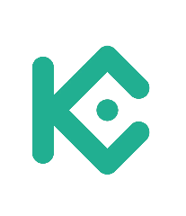

```{r, include = FALSE}
knitr::opts_chunk$set(
  warning = FALSE,
  message = FALSE,
  fig.path = "man/figures/README-",
  fig.align = "center",
  out.width = "100%",
  results = "hold",
  comment = "#>"
)
```

# kucoin 

<!-- badges: start -->
[](https://github.com/dereckscompany/kucoin/actions/workflows/R-CMD-check.yaml)
[](https://lifecycle.r-lib.org/articles/stages.html#experimental)
<!-- badges: end -->

An R API wrapper for the [KuCoin](https://www.kucoin.com/) cryptocurrency exchange. Provides `R6` classes for spot market data, trading, stop orders, OCO orders, account management, deposits, transfers, withdrawals, sub-accounts, margin trading, margin lending, and futures trading. Supports both synchronous and asynchronous (promise based) operation via `httr2`.

## Disclaimer

This software is provided "as is", without warranty of any kind. **This package interacts with live cryptocurrency exchange accounts and can execute real trades, transfers, and withdrawals involving real money.** By using this package you accept full responsibility for any financial losses, erroneous transactions, or other damages that may result. Always test with small amounts first, use API key permissions to restrict access to only what you need, and never share your API credentials. The author(s) and contributor(s) are not liable for any financial loss or damage arising from the use of this software.

We invite you to read the source code and make contributions if you find a bug or wish to make an improvement.

## Design Philosophy

All API responses are returned as `data.table` objects with three
transformations applied:

1.  **snake_case column names** — camelCase keys from the JSON response
    (e.g. `clientOid`, `orderType`, `createdAt`) become snake_case
    (`client_oid`, `order_type`, `created_at`). A handful of endpoints
    additionally reshape nested objects to wide `parent_child` columns
    (e.g. `baseAsset.currency` → `base_asset_currency`) or collapse
    array fields under a plural form. See each method's `@return` for
    the exact column list.

2.  **Type coercion** for well-known columns — KuCoin's millisecond
    timestamps (most endpoints) and nanosecond timestamps (futures
    orderbooks / klines) are both parsed to `POSIXct` in UTC. Numeric
    quantities, prices, and ratios stay as `character` strings because
    KuCoin emits them as strings and the precision matters; cast with
    `as.numeric()` at the point of use if you need arithmetic.

3.  **One entity = one row, no list columns** — every method follows
    the rule *"identify the entity for the endpoint, return one row per
    entity"*. The same convention is shared with the sister `alpaca`
    and `binance` packages so switching between exchanges doesn't mean
    switching mental models.

The five shape treatments the parsers apply, depending on the nested
structure:

| Nested shape | Treatment | Example |
|----|----|----|
| Array of plain strings (`annType`, `permissions`) | Collapsed into one `;`-separated character column. Recover with `strsplit(x, ";", fixed = TRUE)[[1]]`. | `dt$ann_type` → `"latest-announcements;new-listings"` |
| Array of objects (orderbook levels, OCO `orders`, sub-account `balances`) | Exploded to long format with parent fields replicated. A 1-indexed `level` / `sub_order_*` / similar position column is added when order matters. | `get_part_orderbook()` → one row per `(side, level)`. |
| Fixed-schema nested object (`baseAsset` / `quoteAsset` on isolated-margin pairs) | Flattened to wide `parent_child` columns. | `get_isolated_margin_account()` → `base_asset_currency`, `base_asset_borrow_enabled`, … |
| Sibling collection that doesn't fit the row entity | Exposed via a sibling method on the same class so every method still returns one `data.table`. | `KucoinAccount$get_isolated_margin_account()` returns per-pair rows; ad-hoc summaries are sibling methods. |
| Dynamic-key or array-of-array objects | Serialised as a JSON string column; recover with `jsonlite::fromJSON(x)`. | Lending product `tierAnnualPercentageRate` blocks. |

**Two cross-cutting rules** apply to every shape treatment:

1. **Empty / null array → `NA_character_`** (no list cells). An OCO
   order with no children returns `sub_order_id = NA`, not
   `sub_order_id = list()`.
2. **Empty response → empty `data.table`** (no synthetic stub rows).
   `KucoinTrading$cancel_all()` with no open orders returns a zero-row
   table, not a fabricated `(symbol, status = "cancelled")` placeholder.
   The absence of an error is the success signal.

For the full per-treatment catalogue with worked examples, see
`vignette("data-shapes", package = "kucoin")`.

## Installation

```{r, eval = FALSE}
# install.packages("remotes")
remotes::install_github("dereckscompany/kucoin")
```

## Setup

```{r}
# special mock for local build
box::use(
  kucoin[
    get_api_keys,
    get_futures_base_url
  ],
  ./tests/testthat/mock_router[mock_router]
)

KEYS <- get_api_keys(
  api_key = "fake-key",
  api_secret = "fake-secret",
  api_passphrase = "fake-passphrase"
)

BASE <- "https://api.kucoin.com"
FBASE <- "https://api-futures.kucoin.com"

options(httr2_mock = mock_router)

# normal imports
box::use(
  kucoin[
    KucoinMarketData,
    KucoinTrading,
    KucoinAccount,
    KucoinMarginTrading,
    KucoinMarginData,
    KucoinLending,
    KucoinFuturesMarketData,
    KucoinFuturesTrading,
    KucoinFuturesAccount
  ],
  lubridate[ymd_hms]
)
```

Set your API credentials as environment variables in `.Renviron`:

```bash
KUCOIN_API_ENDPOINT = "https://api.kucoin.com"
KUCOIN_API_KEY = your-api-key
KUCOIN_API_SECRET = your-api-secret
KUCOIN_API_PASSPHRASE = your-api-passphrase
```

If you don't have a key, visit the [KuCoin API documentation](https://www.kucoin.com/docs-new).

## Quick Start -- Market Data

Market data endpoints are public and require no authentication.

```{r}
market <- KucoinMarketData$new(keys = KEYS, base_url = BASE)
```

### Price Ticker

```{r}
market$get_ticker(symbol = "BTC-USDT")
```

### 24hr Statistics

```{r}
market$get_24hr_stats(symbol = "BTC-USDT")
```

### Klines (Candlestick Data)

```{r}
market$get_klines(
  symbol = "BTC-USDT",
  timeframe = "1hour",
  from = ymd_hms("2025-01-01 00:00:00"),
  to = ymd_hms("2025-01-02 00:00:00")
)
```

## Trading

Trading endpoints require authentication. Use `add_order_test()` to validate order parameters without placing a real order.

```{r}
trading <- KucoinTrading$new(keys = KEYS, base_url = BASE)
```

### Test Order (No Execution)

```{r}
trading$add_order_test(
  type = "limit",
  symbol = "BTC-USDT",
  side = "buy",
  price = "50000",
  size = "0.0001"
)
```

### Get Open Orders

```{r}
trading$get_open_orders(symbol = "BTC-USDT")
```

## Available Classes

| Class | Purpose |
|-------|---------|
| `KucoinMarketData` | Tickers, klines, orderbooks, currencies, symbols, trade history, server time, service status, fiat prices |
| `KucoinTrading` | Place, cancel, modify, and query HF spot orders; sync variants; DCP dead-man's switch |
| `KucoinStopOrders` | Stop order management with trigger prices |
| `KucoinOcoOrders` | One-Cancels-Other order pairs |
| `KucoinAccount` | Account balances, ledger, HF ledger, fee rates, API key info |
| `KucoinDeposit` | Deposit addresses and history |
| `KucoinTransfer` | Internal transfers between account types (main, trade, margin) |
| `KucoinWithdrawal` | Withdrawal creation, cancellation, quotas, and history |
| `KucoinSubAccount` | Sub-account creation and balance queries |
| `KucoinMarginTrading` | Margin trading: open/close short and long positions, borrow, repay, leverage |
| `KucoinMarginData` | Margin pair info, config, collateral ratios, risk limits |
| `KucoinLending` | Lend assets to earn interest, manage lending orders |
| `KucoinFuturesMarketData` | Futures contract specs, tickers, orderbooks, klines, funding rates |
| `KucoinFuturesTrading` | Place, cancel, and query futures orders; batch orders; DCP |
| `KucoinFuturesAccount` | Futures account overview, positions, margin, leverage, risk limits |

## Fund Transfers and Withdrawals

Essential for trading bots: deposits land in the **main** account, but HF spot orders require funds in the **trade** account.

```{r, eval = FALSE}
transfer <- KucoinTransfer$new()

# Check transferable balance
balance <- transfer$get_transferable(currency = "USDT", type = "MAIN")
print(balance[, .(currency, balance, transferable)])

# Move funds from main to trade account
result <- transfer$add_transfer(
  clientOid = "my-unique-id",
  currency = "USDT",
  amount = "100",
  type = "INTERNAL",
  fromAccountType = "MAIN",
  toAccountType = "TRADE"
)
print(result$order_id)

# Check withdrawal quotas
withdrawal <- KucoinWithdrawal$new()
quotas <- withdrawal$get_withdrawal_quotas(currency = "USDT", chain = "trx")
print(quotas[, .(currency, available_amount, withdraw_min_fee)])
```

## Bulk Kline Download

```{r, eval = FALSE}
# Download historical klines for multiple symbols
kucoin_backfill_klines(
  symbols = c("BTC-USDT", "ETH-USDT"),
  freqs = c("1hour", "1day"),
  from = ymd_hms("2024-01-01 00:00:00"),
  to = ymd_hms("2025-01-01 00:00:00"),
  output_dir = "data/klines"
)
```

## Margin Trading

Margin trading enables short selling and leveraged longs. The package provides intent-based methods that handle borrowing and repayment automatically.

```{r}
margin <- KucoinMarginTrading$new(keys = KEYS, base_url = BASE)
margin_data <- KucoinMarginData$new(keys = KEYS, base_url = BASE)
lending <- KucoinLending$new(keys = KEYS, base_url = BASE)
```

### Open / Close a Short

```{r}
margin$open_short(symbol = "BTC-USDT", size = 0.001)
```

```{r}
margin$close_short(symbol = "BTC-USDT", size = 0.001)
```

### Borrow Rates

```{r}
margin$get_borrow_rate(query = list(currency = "BTC,USDT,ETH"))
```

### Cross Margin Pairs

```{r}
margin_data$get_cross_margin_symbols()
```

### Loan Market

```{r}
lending$get_loan_market()
```

For full margin documentation see `vignette("margin-trading")`.

## Futures Trading

Trade perpetual futures contracts (e.g. XBTUSDTM, ETHUSDTM) with leverage up to 125x. Futures classes use a separate base URL (`https://api-futures.kucoin.com`).

### Futures Market Data

```{r}
futures_market <- KucoinFuturesMarketData$new(keys = KEYS, base_url = FBASE)
```

#### Contract Details

```{r}
futures_market$get_contract(symbol = "XBTUSDTM")
```

#### Futures Ticker

```{r}
futures_market$get_ticker(symbol = "XBTUSDTM")
```

### Futures Trading

```{r}
futures_trading <- KucoinFuturesTrading$new(keys = KEYS, base_url = FBASE)
futures_account <- KucoinFuturesAccount$new(keys = KEYS, base_url = FBASE)
```

#### Futures Test Order

```{r}
futures_trading$add_order_test(
  clientOid = "readme-test-001",
  symbol = "XBTUSDTM",
  side = "buy",
  type = "limit",
  leverage = 5,
  size = 1,
  price = "98000"
)
```

#### Positions

```{r}
futures_account$get_positions()
```

For full futures documentation see `vignette("futures-trading")`.

## Async Usage

This package is meant to be used in an asynchronous non-blocking event loop (i.e. à la JavaScript) and is written around promises. Please use `later` to run your event loop. I recommend the pattern shown below.

We offer a synchronous and asynchronous instance of the classes. All classes accept `async = TRUE`, this makes methods return promises instead of objects. You can resolve promises in whichever way you like, either `$then()` chaining or `async`/`await` patterns.

I recommend use `coro::async()` to write sequential looking async code:

```{r}
box::use(coro, later)

market_async <- KucoinMarketData$new(keys = KEYS, base_url = BASE, async = TRUE)

main <- coro$async(function() {
  ticker <- await(market_async$get_ticker(symbol = "BTC-USDT"))
  klines <- await(market_async$get_klines(symbol = "BTC-USDT", timeframe = "1hour"))

  print(ticker)
  print(klines)
})

main()

while (!later$loop_empty()) {
  later$run_now()
}
```

## Sample Data

The package includes bundled historical OHLCV data for BTC-USDT at 4-hour intervals (October 2017 through March 2026):

```{r}
data(kucoin_btc_usdt_4h_ohlcv)
head(kucoin_btc_usdt_4h_ohlcv)
```

## Citation

If you use this package in your work, please cite it:

```r
citation("kucoin")
```

> Mezquita, D. (2026). kucoin: R API Wrapper to KuCoin Cryptocurrency
> Exchange. R package version 4.0.0.

## Licence

MIT &copy; [Dereck Mezquita](https://github.com/dereckmezquita) [](https://orcid.org/0000-0002-9307-6762). See [LICENSE](LICENSE) for the full text.
